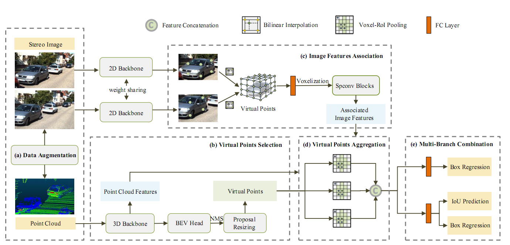

# VPFNet
<p align="center">  </p>

 
This is the official implementation of [**VPFNet: Improving 3D Object Detection with Virtual Point based LiDAR and Stereo Data Fusion**](https://arxiv.org/abs/2111.14382), built on [`OpenPCDet`](https://github.com/open-mmlab/OpenPCDet).


    @ARTICLE{VPFNet,
        author={Zhu, Hanqi and Deng, Jiajun and Zhang,
        Yu and Ji, Jianmin and Mao, Qiuyu and Li, Houqiang
        and Zhang, Yanyong},
        journal={IEEE Transactions on Multimedia},
        title={VPFNet: Improving 3D Object Detection
        with Virtual Point based LiDAR and Stereo Data
        Fusion},
        year={2022}
    }

### Installation
1.  Prepare for the running environment. 

    For snake, follow the installation steps in [snake](https://github.com/zju3dv/snake).
    For VPFNet, use the docker image provided here, or follow the installation steps in [`OpenPCDet`](https://github.com/open-mmlab/OpenPCDet). 

    ```
    docker pull djiajun1206/pcdet-pytorch1.5
    ```

2. Prepare for the data.

    Please download the [Kins dataset](https://github.com/qqlu/Amodal-Instance-Segmentation-through-KINS-Dataset) and official [KITTI 3D object detection](http://www.cvlibs.net/datasets/kitti/eval_object.php?obj_benchmark=3d) dataset. Train the snake model using the split in /data/kitti/ImageSets/train.txt,
    then generate the 2D bounding box and 2D instance mask. 
    
    ```
    python run.py --type evaluate --cfg_file configs/kins_snake.yaml test.dataset KinsVal     
    ```
    
    Then organize the files as follows (the road planes could be downloaded from [[road plane]](https://drive.google.com/file/d/1d5mq0RXRnvHPVeKx6Q612z0YRO1t2wAp/view?usp=sharing):


    ```
    VPFNet
    ├── data
    │   ├── kitti
    │   │   │── ImageSets
    │   │   │── training
    │   │   │   ├──calib & velodyne & label_2 & image_2 & image_3 &  planes & image_2_box & image_2_snake & image_3_box & image_3_snake  
    │   │   │── testing
    │   │   │   ├──calib & velodyne & image_2 & image_3
    ├── pcdet
    ├── tools
    ```
    Generate the data infos by running the following command:
    ```
    python -m pcdet.datasets.kitti.kitti_dataset create_kitti_infos tools/cfgs/dataset_configs/kitti_dataset.yaml
    ```

3. Setup.

    ```
    python setup.py develop
    ```

### Getting Started
1. Training.
    
    The configuration file is in tools/cfgs/kittimodels, and the training scripts is in tools/scripts.

    ```
    cd tools
    bash ./scripts/dist_train.sh 8 --cfg_file  ./cfgs/kitti_models/VPFNet.yaml  --batch_size 16 --epochs 80 --workers 8
    ```

2. Evaluation.

    The configuration file is in tools/cfgs/VPFNet, and the training scripts is in tools/scripts.

    ```
    cd tools
    python test.py --cfg_file  ./cfgs/kitti_models/VPFNet.yaml  --batch_size 4  --eval_all
    ```


### Acknowledge
Thanks to the strong and flexible [`OpenPCDet`](https://github.com/open-mmlab/OpenPCDet) codebase maintained by Shaoshuai Shi ([@sshaoshuai](http://github.com/sshaoshuai)) and Chaoxu Guo ([@Gus-Guo](https://github.com/Gus-Guo)).

### Contact
This repository is implemented by Hanqi Zhu (zhuhanqi@mail.ustc.edu.cn).
